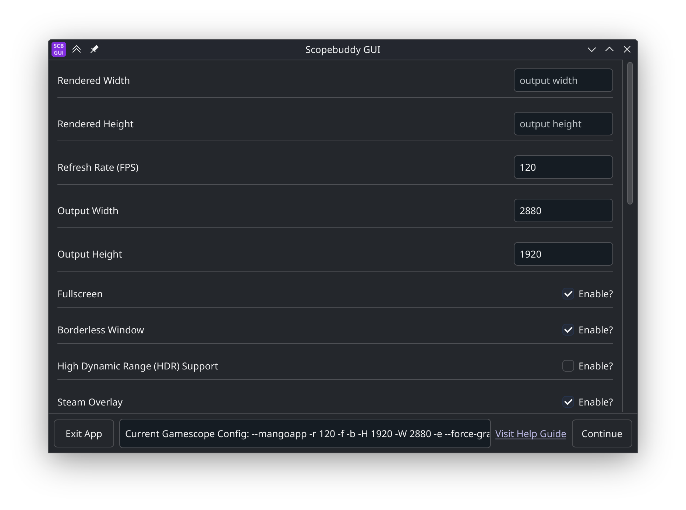
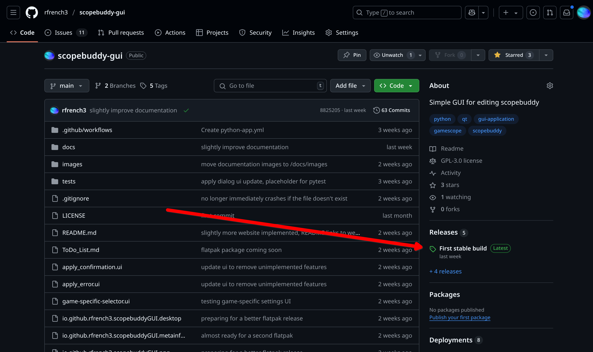

<h1 align="center">ScopeBuddy GUI</h1>

<h2 align="center">A Graphical Frontend for the scopebuddy tool.</h2>

<h1 align="center">Features</h1>

This is a convenient, easy-to-use interface for configuring Gamescope through Scopebuddy. Gamescope, which plays a large role in the interface of the SteamDeck, has many features that allow for precise control of many aspects of rendering games and other programs. This is **especially** useful with screens such as ultrawide monitors and others that have an unusual aspect ratio. These features, which may have previously been too complicated for many to use, include:

- Setting a normal screen resolution and aspect ratio for games to run through.
- Support for features like High Dynamic Range (HDR) and Adaptive Sync.
- Running games at a lower resolution to greatly improve FPS.

While a lot of games will handle oddities like a strange aspect ratio gracefully, a lot of games do not.

 

<h1 align="center">Requirements</h1>

This GUI is only useful if you also have scopebuddy and gamescope installed, and it currently does not install those dependencies for you. The github pages for the required programs are:
- [Gamescope](https://github.com/ValveSoftware/gamescope)
- [Scopebuddy](https://github.com/HikariKnight/scopebuddy)

Gamescope is likely available for easy installation through your Linux Distro's package manager. Helpful information regarding the usage of gamescope can be found in my [documentation.](https://rfrench3.github.io/scopebuddy-gui)

 

<h1 align="center">Where to Install the Latest Release</h1>

Clicking the image also brings you to the releases.

 

<h1 align="center">License</h1>

GPL-3.0-only. See LICENSE for details.

 

<h1 align="center">Build Instructions</h1>

Once you have all of the required dependencies, within the root folder (the one that contains the .yml) run the following commands in order:

- flatpak-builder --force-clean --repo=repo builddir io.github.rfrench3.scopebuddy-gui.yml

- flatpak build-bundle repo scopebuddy-gui.flatpak io.github.rfrench3.scopebuddy-gui --verbose

(Running the first command and reviewing the errors is a simple way to locate other build dependencies)

