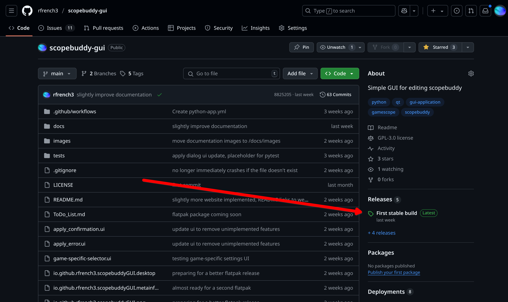

# General Github Tutorial - how to install a new app release!

- [Link to the releases page!](https://github.com/rfrench3/scopebuddy-gui/releases)

# ScopeBuddy GUI
Graphical Frontend for the scopebuddy tool.

This GUI is only useful if you also have scopebuddy and gamescope installed, and it currently does not install those dependencies for you. The documentation contains links to the required programs.

- [Link to the documentation! (in progress)](https://rfrench3.github.io/scopebuddy-gui)

# Build Instructions

Within the source folder, run:

- flatpak-builder --force-clean --repo=repo builddir io.github.rfrench3.scopebuddy-gui.yml

- flatpak build-bundle repo scopebuddy-gui.flatpak io.github.rfrench3.scopebuddy-gui --verbose
